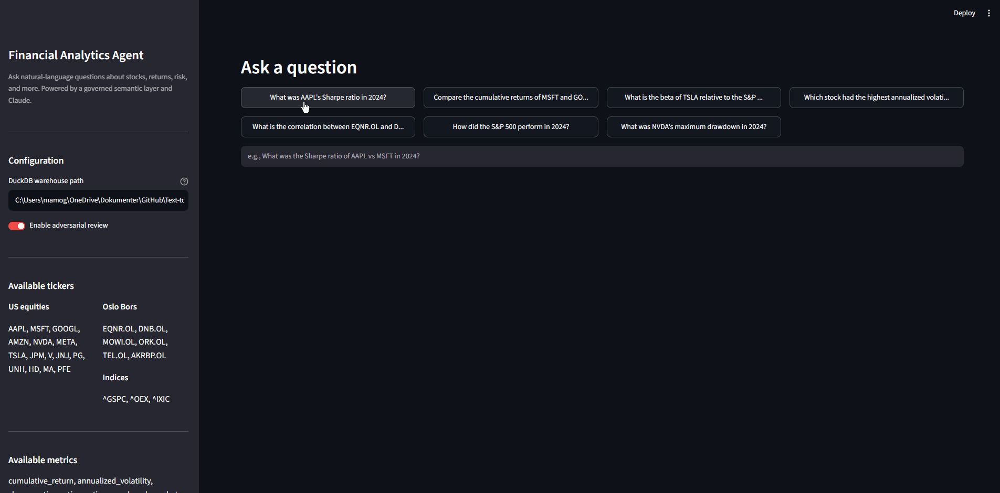

# Text-to-SQL Analytics Agent

An agentic text-to-SQL system for financial market data that implements the 4-layer analytics stack from [Anthropic's approach to agentic analytics](https://www.anthropic.com/engineering/analytics-with-claude). Takes natural language questions about stocks and markets, resolves them through a governed semantic layer and markdown skill files, generates SQL against a DuckDB warehouse, runs adversarial review, and returns answers with provenance footers.



## Results

Measured on the 52-case offline eval suite (weighted rubric: metric resolution, SQL pattern correctness, execution, numeric accuracy within per-case tolerance — see [`evals/EVAL_TIMELINE.md`](evals/EVAL_TIMELINE.md) for the full running log):

| Configuration | Pass rate | Avg score | What it measures |
|---------------|-----------|-----------|------------------|
| **Full pipeline** (semantic layer + LLM fallback + adversarial review) | **50/52 (96%)** | 0.929 | The system as shipped |
| Semantic layer only (deterministic, no LLM) | 39/52 (75%) | — | The governed layer alone — 91% (29/32) on the domains it is designed to cover |

The gap between the two rows is the point of the architecture: deterministic governed metrics answer the common questions identically every time, and the LLM fallback (guided by skill files, checked by the adversarial reviewer) covers the long tail. Every improvement is benchmarked — eval runs are logged over time in [`evals/EVAL_TIMELINE.md`](evals/EVAL_TIMELINE.md), and CI blocks changes that regress accuracy.

## Architecture

```
┌──────────────────────────────────────────────────────────────┐
│  USER QUESTION                                               │
│  "What was the Sharpe ratio of AAPL vs MSFT last quarter?"   │
└──────────────────────┬───────────────────────────────────────┘
                       ▼
┌──────────────────────────────────────────────────────────────┐
│  LAYER 4: VALIDATION                                         │
│  • Adversarial review sub-agent (9 error checks)             │
│  • Provenance footer (source tier, freshness, confidence)    │
│  • Offline eval suite (52 Q&A pairs, CI-gated)               │
└──────────────────────┬───────────────────────────────────────┘
                       ▼
┌──────────────────────────────────────────────────────────────┐
│  LAYER 3: SKILLS (markdown playbooks)                        │
│  • Knowledge skill → routes to correct domain reference doc  │
│  • Analyst skill → step-by-step procedure + reusable         │
│    analysis patterns (return decomposition, risk metrics)     │
└──────────────────────┬───────────────────────────────────────┘
                       ▼
┌──────────────────────────────────────────────────────────────┐
│  LAYER 2: SOURCES OF TRUTH                                   │
│  • Semantic layer (14 governed metric definitions in YAML)   │
│  • Dimension + segment definitions                           │
│  • YAML-to-SQL compiler                                      │
└──────────────────────┬───────────────────────────────────────┘
                       ▼
┌──────────────────────────────────────────────────────────────┐
│  LAYER 1: DATA FOUNDATIONS                                   │
│  • DuckDB warehouse with canonical tables                    │
│  • Dimensional model (fact_daily_prices, dim_securities...)  │
│  • Data quality checks (freshness, completeness, anomalies)  │
└──────────────────────────────────────────────────────────────┘
```

## How It Works

Raw LLMs writing SQL get the answer wrong most of the time on real warehouses. Anthropic identified three failure modes responsible for almost all errors, and this project solves each with a dedicated layer:

| Failure Mode | What Goes Wrong | Solution |
|---|---|---|
| **Concept ambiguity** | "Returns" could mean simple, log, cumulative, or annualized — the LLM picks the wrong one | **Semantic layer** with 14 governed metric definitions, each with exactly one canonical SQL expression |
| **Retrieval failure** | The right table exists but the LLM doesn't find it among dozens of options | **Skills** (markdown playbooks) that narrow the search to a handful of curated reference docs per domain |
| **Unchecked errors** | Wrong joins, missing filters, currency mixing, NULL edge cases | **Adversarial reviewer** that checks every query against 9 common error types before execution |

### Walkthrough: What Happens When You Ask a Question

```
You: "What was EQNR.OL's cumulative return in Q3 2024?"
```

**Step 1 — CLARIFY:** Claude interprets the question — ticker: EQNR.OL, metric: cumulative return, period: Q3 2024 (Jul 1 - Sep 30).

**Step 2 — RESOLVE:** The semantic resolver matches "cumulative return" to the governed `cumulative_return` metric in `metrics.yaml`. The YAML-to-SQL compiler produces:
```sql
SELECT fp.ticker,
    (LAST(adjusted_close ORDER BY date) / FIRST(adjusted_close ORDER BY date)) - 1 AS value
FROM fact_daily_prices fp
WHERE fp.ticker IN ('EQNR.OL')
  AND fp.date >= '2024-07-01' AND fp.date <= '2024-09-30'
  AND fp.adjusted_close IS NOT NULL
GROUP BY fp.ticker
```
The LLM never invents the formula — it comes from the governed definition. Note the `IS NOT NULL` guard: the compiler adds it automatically because Oslo Bors tickers can have NULL prices on partial trading days.

**Step 3 — REVIEW:** The adversarial reviewer checks the query against 9 error types (wrong grain, missing filters, currency mixing, calendar mismatches, NULL handling, ...) and can rewrite the SQL before it runs.

**Step 4 — EXECUTE & DELIVER:** The query runs against DuckDB and the result is formatted with a provenance footer:

```
Answer:  EQNR.OL cumulative return: -8.23%
Source:  fact_daily_prices
Currency: NOK
Metric source: semantic_layer
```

For questions the semantic layer *doesn't* cover (e.g., "build a correlation matrix for 5 tech stocks"), the agent falls through to Claude-powered SQL generation, guided by the domain-specific reference docs from the skills layer. And for questions the *warehouse* can't answer (e.g., P/E ratios — no fundamentals data is ingested), the agent says so honestly instead of inventing a query; there are eval cases asserting exactly that behavior.

### Project Structure

```
├── data/                          # Layer 1: Data Foundations
│   ├── ingestion/
│   │   ├── ingest_prices.py       #   yfinance → DuckDB (24 tickers, 5 years)
│   │   └── quality_checks.py      #   Freshness, completeness, anomaly checks
│   └── warehouse.duckdb           #   DuckDB warehouse (gitignored, built by ingestion)
│
├── semantic_layer/                # Layer 2: Sources of Truth
│   ├── metrics.yaml               #   14 governed metric definitions
│   ├── dimensions.yaml            #   Security + time dimensions
│   ├── segments.yaml              #   Named filters (us_equities, tech_stocks, ...)
│   └── compiler.py                #   YAML → executable DuckDB SQL
│
├── skills/                        # Layer 3: Skills
│   ├── knowledge.md               #   Router: question domain → reference doc
│   ├── analyst.md                 #   6-step procedural playbook
│   └── references/                #   Domain-specific guides with gotchas + SQL patterns
│       ├── returns_and_risk.md
│       ├── portfolio_analytics.md
│       ├── market_overview.md
│       └── fundamentals.md
│
├── agent/                         # Layer 4: Agent + Validation
│   ├── orchestrator.py            #   Main pipeline: clarify → resolve → query → review → deliver
│   ├── semantic_resolver.py       #   NL question → governed metric + compiled SQL
│   ├── sql_generator.py           #   Claude-powered SQL for complex questions
│   ├── reviewer.py                #   Adversarial review (5 static + 9 LLM checks)
│   └── response_formatter.py      #   Provenance footer + structured output
│
├── evals/                         # Offline Eval Suite
│   ├── fixtures/                  #   52 Q&A test cases across 5 domains
│   ├── run_evals.py               #   Eval runner (metric resolution + SQL correctness)
│   ├── ablation.py                #   A/B testing for skill changes
│   └── EVAL_TIMELINE.md           #   Running log of eval results over time
│
├── tests/                         # 146 pytest tests (no API key needed)
│
└── .github/workflows/eval_ci.yml  # CI: tests + deterministic evals on every push; full evals on demand
```

## Setup

```bash
# Clone the repo
git clone https://github.com/martinmoll/Text-to-SQL-analytics-agent.git
cd Text-to-SQL-analytics-agent

# Install dependencies
pip install -e .

# Run data ingestion (pulls 5 years of daily prices for 24 tickers)
python data/ingestion/ingest_prices.py

# Run quality checks
python data/ingestion/quality_checks.py

# Set your API key for the agent (a .env file in the repo root also works)
export ANTHROPIC_API_KEY=your-key-here
```

## Usage

```bash
# Web UI (recommended)
streamlit run app/streamlit_app.py

# Interactive CLI
python -m agent.orchestrator

# Ask a question programmatically
python -c "
from agent import AnalyticsAgent
agent = AnalyticsAgent()
response = agent.answer('What was AAPL Sharpe ratio in 2024?')
print(response.to_markdown())
"

# Run unit tests (no API key needed)
python -m pytest tests/

# Run offline evals (resolution-only, no API key needed)
python -m evals.run_evals --no-llm --verbose

# Run full evals (requires ANTHROPIC_API_KEY and warehouse.duckdb)
python -m evals.run_evals --verbose --save

# Compare eval results (ablation testing)
python -m evals.ablation baseline.json candidate.json
```

## Agent Pipeline

The orchestrator follows the analyst skill's 6-step workflow for every question:

1. **CLARIFY** — Disambiguate the question (returns type, time period, benchmark)
2. **RESOLVE** — Check the semantic layer for a governed metric definition
3. **FIND** — Route to the correct reference doc via the knowledge skill
4. **QUERY** — Generate SQL (from semantic compiler or LLM with skill guidance)
5. **REVIEW** — Adversarial check for 9 common error types (wrong grain, missing filters, currency mixing, NULL handling, etc.)
6. **DELIVER** — Execute, format results, append provenance footer

## Data Model

| Table | Grain | Description |
|-------|-------|-------------|
| `fact_daily_prices` | ticker x date | OHLCV + adjusted close + computed daily returns |
| `dim_securities` | ticker | Name, sector, industry, exchange, currency, security_type |
| `dim_calendar` | date x exchange | Trading days with year, quarter, month, day attributes |
| `raw_daily_prices` | ticker x date | Staging table with raw yfinance data |

**Ticker universe:** US large-caps (AAPL, MSFT, GOOGL, AMZN, NVDA, META, TSLA, JPM, V, JNJ, PG, UNH, HD, MA, PFE), Oslo Bors (EQNR.OL, DNB.OL, MOWI.OL, ORK.OL, TEL.OL, AKRBP.OL), indices (^GSPC, ^OEX, ^IXIC).

The Oslo Bors tickers are included deliberately: they force multi-currency (USD/NOK) and multi-calendar edge cases into every layer — `dim_calendar` has grain date x exchange because Oslo and New York have different trading days, and the reviewer fails any query that joins the calendar on date alone.

## Semantic Layer

14 governed metrics across returns, volatility, risk-adjusted, drawdown, correlation, and price/volume categories. Each metric has a canonical SQL expression, parameter defaults, and documented gotchas.

| Category | Metrics |
|----------|---------|
| Returns | daily_simple_return, daily_log_return, cumulative_return, total_return_index, annualized_return |
| Volatility | annualized_volatility |
| Risk-adjusted | sharpe_ratio, sortino_ratio |
| Drawdown | max_drawdown |
| Correlation | beta, correlation |
| Price/Volume | average_daily_volume, price_range, vwap |

## Eval Suite

52 eval cases across 5 domains, testing metric resolution, SQL correctness, and answer accuracy:

| Domain | Cases | Tests |
|--------|-------|-------|
| Returns & Risk | 15 | Cumulative return, volatility, Sharpe, Sortino, drawdown |
| Risk / Beta | 12 | Beta, correlation, R-squared, rolling windows |
| Portfolio | 8 | Relative performance, cross-exchange, sector comparison |
| Market Overview | 12 | Index performance, sector averages, market breadth |
| Fundamentals | 5 | Correctly handles "data not available" |

Results over time are logged in [`evals/EVAL_TIMELINE.md`](evals/EVAL_TIMELINE.md). CI is two-tier by design: the deterministic tier (146 unit tests + resolution-only evals, gated against the committed `resolution_baseline.json`) runs free on every push and PR, so a red X always means a real break. The LLM tier (full agent evals with ablation regression checks against the latest committed result file) costs API credits and has sampling variance, so it is triggered manually from the GitHub Actions tab and requires the `ANTHROPIC_API_KEY` repository secret.

## Forking & Continuing Development

The project is designed to be extended. If you fork it, the workflow that keeps quality intact:

**Golden rule: every change is benchmarked.** Before changing anything, save a baseline (`python -m evals.run_evals --save`). After your change, run again and compare with `python -m evals.ablation <baseline>.json <candidate>.json`. Log both in `evals/EVAL_TIMELINE.md`. The eval suite — not vibes — decides whether a prompt tweak or metric change helped.

**To add a governed metric** (the most common extension):
1. Define it once in `semantic_layer/metrics.yaml` — expression, `requires_group_by`/`requires_filter`, parameter defaults, and a `notes` field with gotchas.
2. Add natural-language aliases to `_PHRASE_MAP` in `agent/semantic_resolver.py` so questions resolve to it deterministically.
3. Add eval cases in `evals/fixtures/` covering it (including a tricky variant), and unit tests if the compiler needs new behavior.
4. Run `pytest` + both eval modes.

**To add a new domain** (e.g., actually ingesting fundamentals — the planned schema is already documented in `skills/references/fundamentals.md`):
1. Build the ingestion script and canonical table (one source of truth per concept — no near-duplicate views).
2. Write a reference doc in `skills/references/` with business context, table grain, gotchas, and SQL patterns; register it in `skills/knowledge.md` and `_ROUTE_KEYWORDS` in the resolver.
3. Extend `data/ingestion/quality_checks.py` with freshness/completeness checks for the new table.
4. Replace the "data not available" eval cases in `evals/fixtures/fundamentals_evals.json` with real Q&A cases.

**Things to keep in mind:**

- **The semantic layer is the source of truth.** Never let the LLM define a metric formula — if a question keeps falling through to LLM generation, that's a signal to add a governed metric, not to trust the generated SQL more.
- **Watch the known data gotchas.** Oslo Bors tickers have NULL `adjusted_close` on partial trading days (the compiler auto-guards FIRST/LAST aggregates; LLM SQL relies on the reviewer's check). Never compare USD and NOK prices without flagging it. Index tickers (`^GSPC`, ...) must be excluded from "stocks" questions via `security_type = 'equity'`. `dim_calendar` must always be joined on **both** date and exchange.
- **Rebuilding the warehouse can shift ground truths.** `adjusted_close` is retroactively adjusted for dividends/splits, so re-running ingestion may move historical values slightly. If numeric eval assertions start failing after a re-ingest, recompute the fixtures' ground truths rather than loosening tolerances.
- **The unit tests are free — use them.** All 146 pytest tests cover the deterministic components (compiler, resolver, static review checks, formatter) and run without an API key or warehouse.
- **Honest failure is a feature.** The fundamentals eval cases assert the agent *says* data is unavailable rather than hallucinating a query. If you add data sources, keep negative-path cases for whatever is still missing.

**Known limitations / good first extensions:** rolling-window metrics aren't supported by the compiler (they fall through to the LLM — see `ret_08`); the fuzzy metric lookup in `compiler.lookup()` uses naive substring scoring and could be replaced with proper tokenization; fundamentals ingestion is designed but not built; stretch ideas in `self-service-analytics-agent-project-plan.md` include an MCP server and an ablation dashboard.

## Project Status

- [x] Phase 1: Data Foundations — DuckDB warehouse, ingestion pipeline, quality checks
- [x] Phase 2: Semantic Layer — 14 YAML metric definitions, dimensions, segments, SQL compiler
- [x] Phase 3: Skills — Analyst playbook, knowledge routing, 4 domain reference docs
- [x] Phase 4: Agent + Validation — Orchestrator, adversarial review, 52-case eval suite, CI
- [x] Phase 5: UI + Polish — Streamlit app with reasoning trace, SQL display, and provenance
- [x] Hardening — 146-test suite, eval baselines + timeline, targeted accuracy fixes

## Tech Stack

- **Python 3.11+** with pip/uv
- **DuckDB** — embedded analytical warehouse
- **yfinance** — free financial market data
- **Claude API** (Anthropic SDK) — LLM agent for text-to-SQL
- **Streamlit** — web UI
- **pytest** — unit tests + offline eval suite
